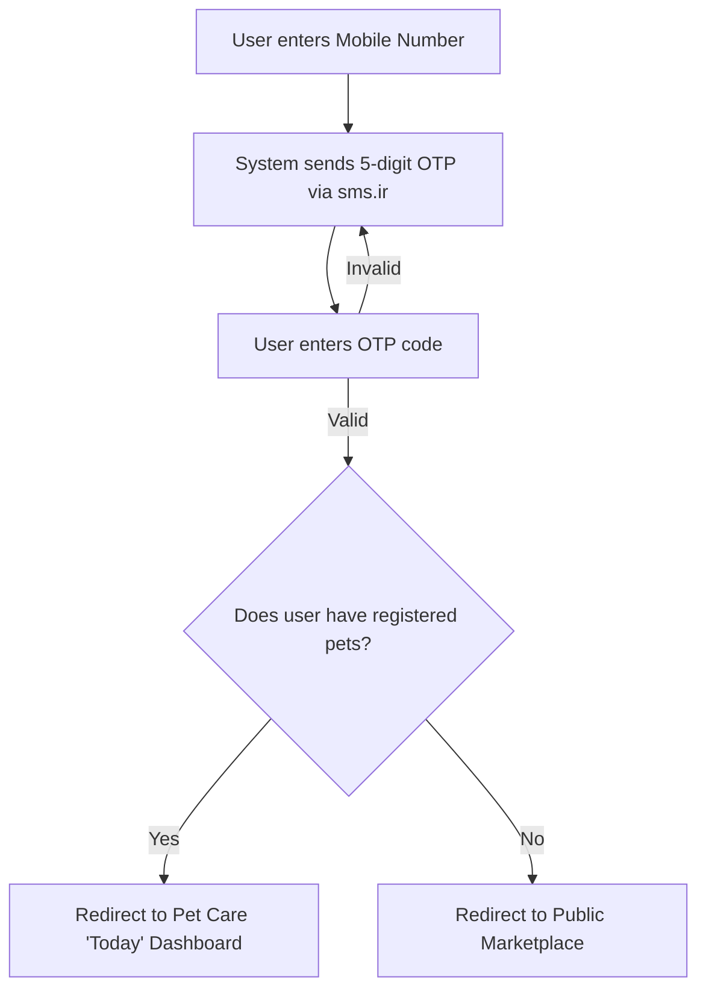
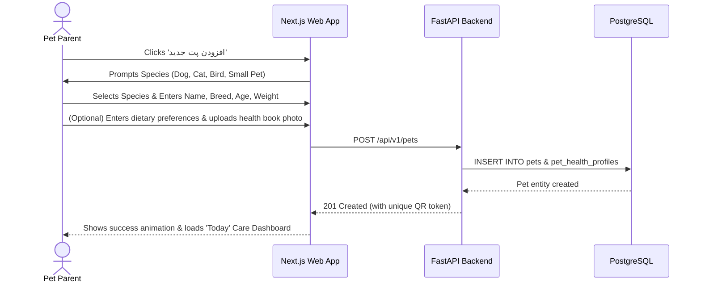
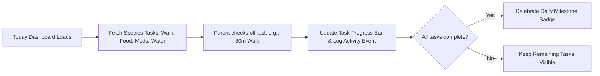
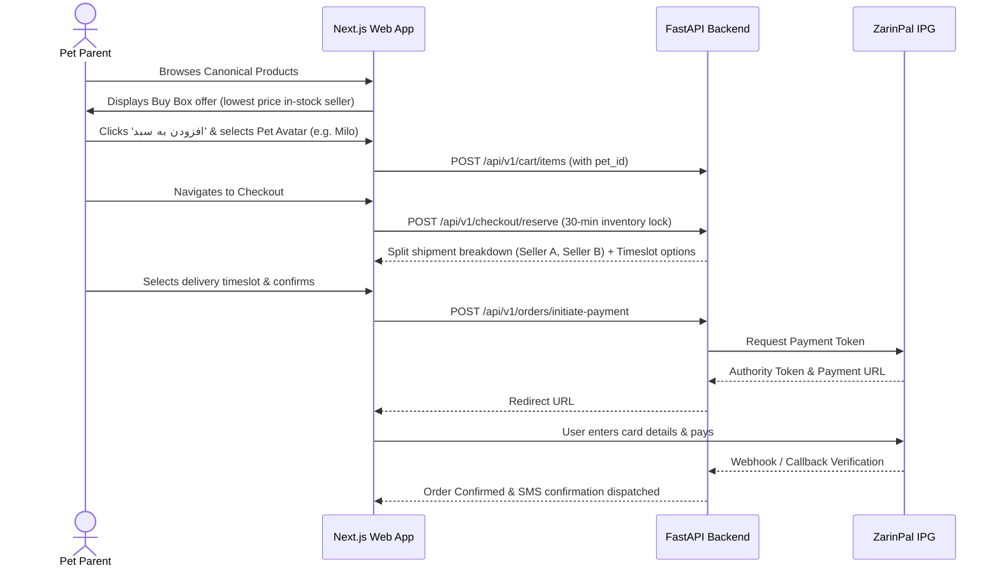
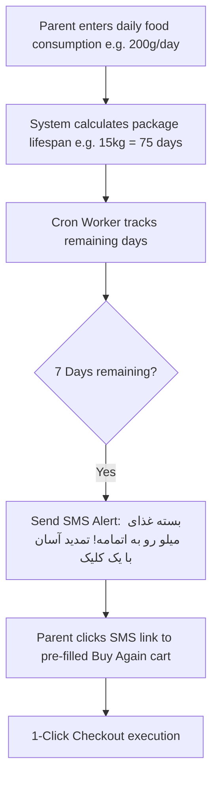
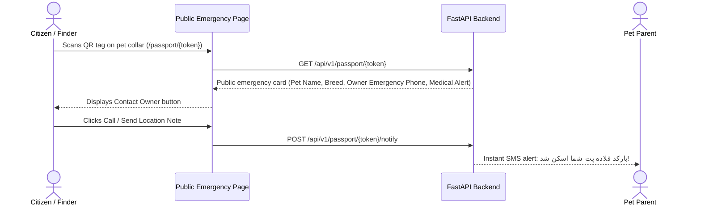

# Core User Flows

## Flow 1: Authentication & Dynamic Landing

## Flow 2: Pet Profile Creation (Pet-First Onboarding)

## Flow 3: Daily Care Routine & Task Check-off

## Flow 4: Pet-Connected Shopping & Multi-Seller Checkout

## Flow 5: Smart Reorder & Automated Replenishment

## Flow 6: QR Pet Passport & Lost Pet Safety

